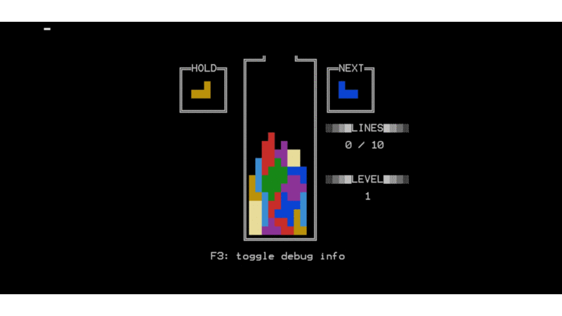

### *NOTE: THIS IS A PROTOTYPE CREATED WHILE LEARNING C++ IN 2018. I HAVE NO PLANS ON CONTINUING THIS PROJECT, AND THE CODE IN THIS PROJECT IS NOT INDICATIVE OF MY CURRENT CODING STYLE.*

# tetris-cmd
Tetris for the Windows Command Prompt.

Uses Super Rotation, Initial Rotation, Initial Hold, (Initial) Auto Shift, and 7-bag.

**NOTE:** it is highly recommended that you set your console font to "Raster Fonts" 12x16 *when you run the executable!*

## Controls

|Command           |Key          |
|:-----------------|------------:|
|Left              |LEFT ARW     |
|Right             |RIGHT ARW    |
|Counter-Clockwise |[Z]          |
|Clockwise         |[X] / UP ARW |
|Soft Drop         |DOWN ARW     |
|Hard Drop         |[SPACE]      |
|Quit              |[ESC]        |
|Hold Piece        |[C]          |
|Debug Info Toggle |[F3]         |

## To-do list
  * pausing
  * menus + game settings
  * scoring system
  * code refinement/clean up
